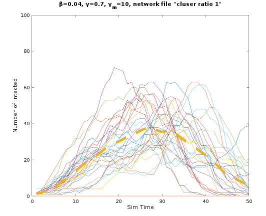
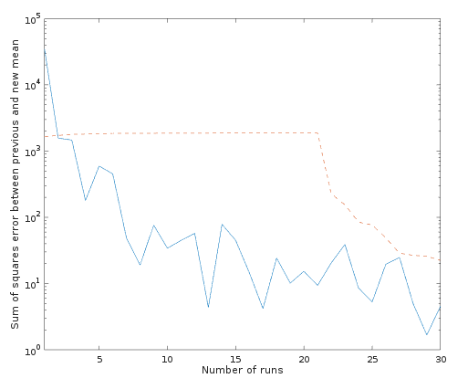
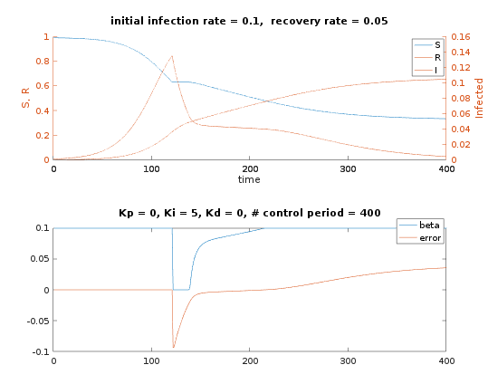

#Stochastic Modelling
See pdf for model details. A completed simulation is shown with 30 runs. Dashed yellow line is the mean of all curves.

Simulation is deemed complete when the sum of squares error of the mean curves before and after the addition of another run apporaches a sufficiently small number. In the plot below the blue trace is the run to run sse and the dashed trace is a moving average.

# Epidemic-Control
A control systems approach to epidemic control. 

Natural epidemic progression with no controls.

Small control periods, i.e., real time control, gives good results.

Large control periods, i.e., delay from infection, testing, to action produces poor results.

Delay from infection to control applied does not affect the performance unless this delay is excessivly large. e.g., see below delay of 120 units

