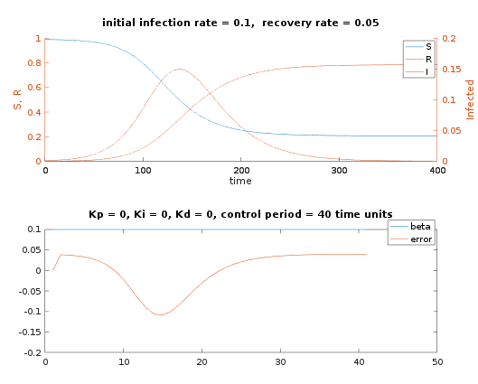
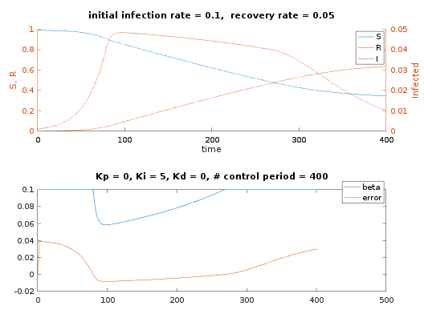
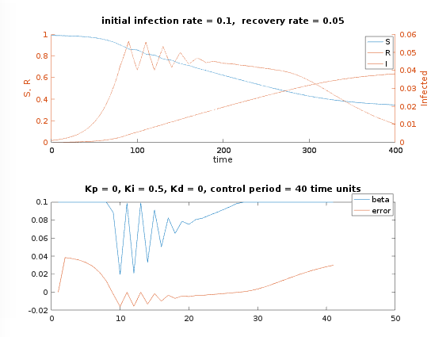

# Epidemic-Control
A control systems approach to epidemic control. 

Natural epidemic progression with no controls.

Small control periods, i.e., real time control, gives good results.

Large control periods, i.e., delay from infection, testing, to action produces poor results.

